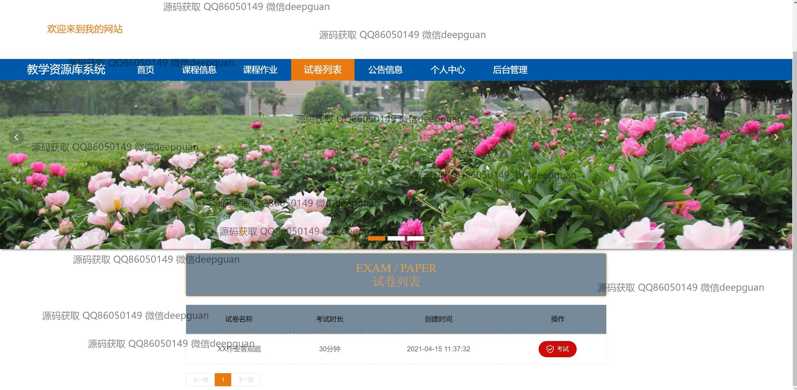
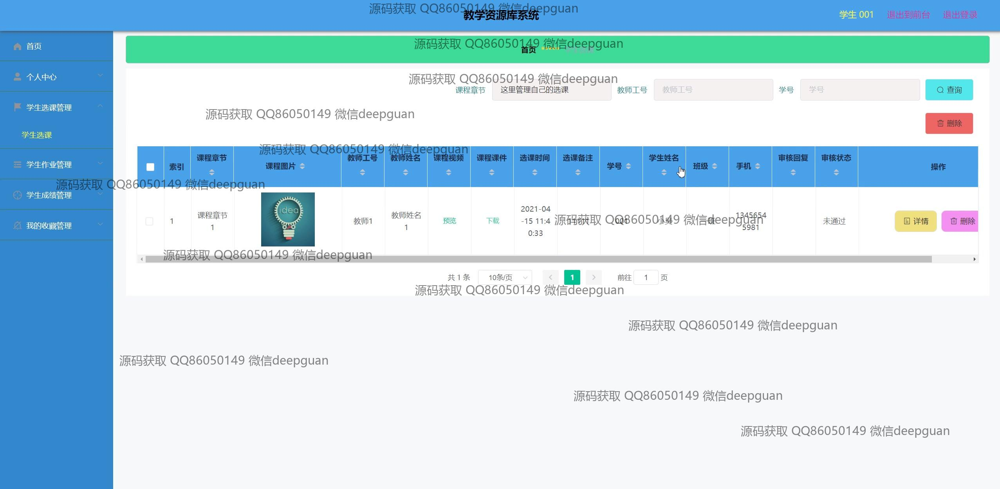
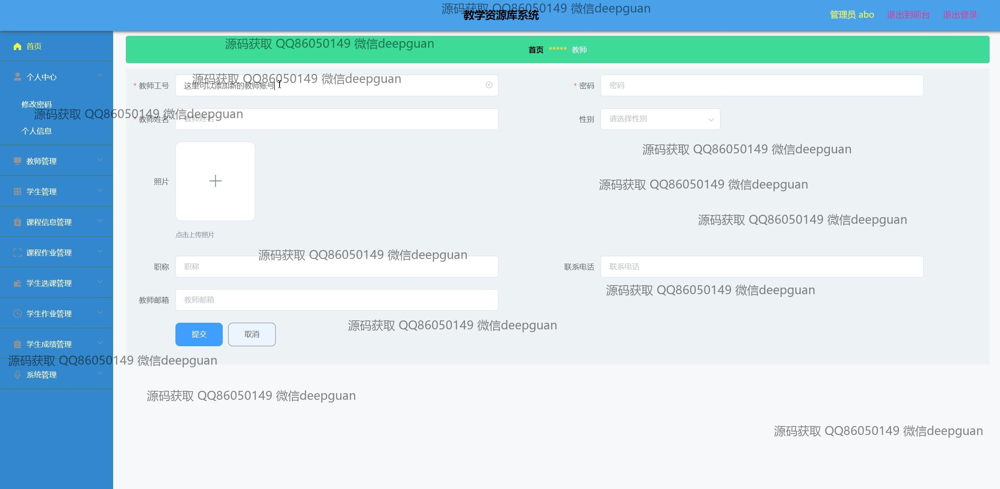

<h1 align="center">教学资源库</h1>

## 简介
教学资源库系统：角色分为管理员和用户；功能包括课程信息管理、作业管理、试卷管理与学生成绩管理，支持资源浏览、下载和上传，提升教学和学习体验。    --计算机毕业设计源码；毕设源码；java毕业设计源码

## 联系方式

<h3 align="center">获取完整代码与数据库文件 + 微信：deepguan QQ: 86050149 QQ群: 783742310</h3>

<h3 align="center">可帮忙远程部署 包运行成功！提供远程部署、修改代码、设计文档指导、代码讲解等服务！</h3>

## 功能介绍（完整见运行截图）
教师：提供教师管理界面，可输入和编辑教师的基本信息如姓名、性别、联系方式等。支持课程信息管理、试卷和作业管理，通过系统上传和管理教学资源，发布和管理课程作业及试题，查看和评分学生作业。可通过导航菜单在个人中心、课程信息管理和系统管理间切换，支持考试记录和学生成绩的管理。拥有权限进行系统操作及用户信息的更新。  
学生：可通过注册界面输入学号、班级、密码等基本信息以注册，登录后可查看和管理个人信息。访问首页、课程信息、试卷列表、个人中心等模块功能。可观看课程视频、查看作业要求、提交作业及考试，通过富文本编辑器填写或上传内容。查看考试记录和成绩详情，参与评论或收藏课程资源。  
管理员：具备系统后台管理权限，负责全局系统设置和管理。管理学生及教师信息，支持添加、更新及删除操作。可通过后台管理模块完成课程管理、信息发布及系统资源的维护。处理用户注册、身份验证等安全管理，通过接口与用户交互，保证教学资源的完整和更新。  
系统用户：分为教师和学生两类用户。学生通过选课系统管理个人课程信息，查看视频资源及评论交流；教师管理学生资料、课程信息及考试评分。系统支持多用户登陆管理，确保用户能根据角色身份在个人中心有效操作，通过导航栏在不同功能模块间切换，提升用户整体体验。

## 运行截图

本代码来源于网络,仅供学习参考使用!

